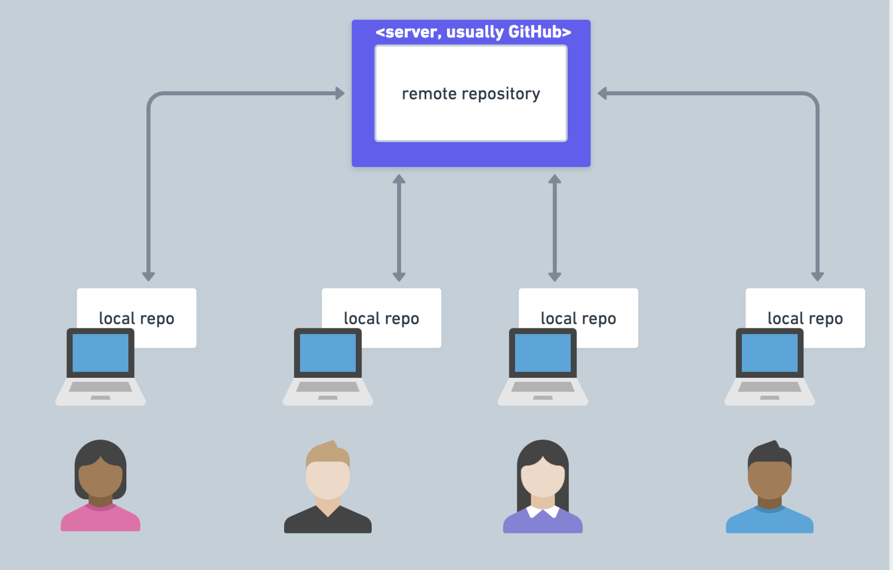
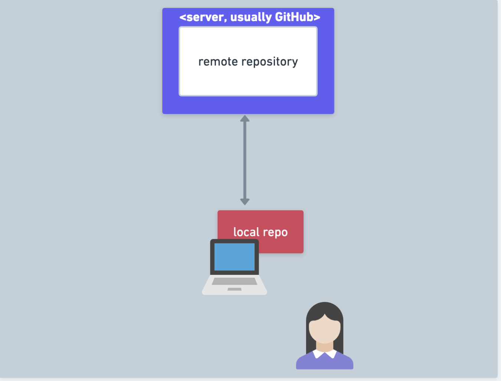
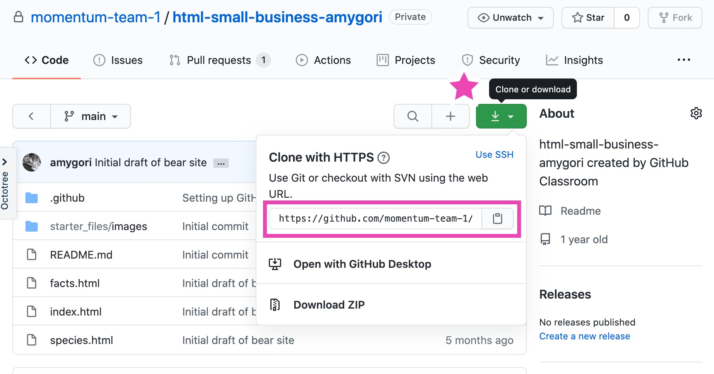

# Git & GitHub: An intro to development tools you will use every day

## Why use git?

### Collaborate

Write code (or other types of documents) with other people.

### Track and revert changes

Mistakes happen. Wouldn't it be nice if you could see the changes that have been made and go back in time to fix something that went wrong?

## You already manage versions of your work!

Do you have files somewhere that look like this?

```
Resume­September2019.docx
Resume­for­Duke­Job.docx
ResumeOLD.docx
ResumeNEW.docx
ResumeFINAL.docx
ResumeREALLYFINAL.docx
```

You invented your own version control!

## Git allows developers to work together in a shared codebase



## You will be working solo for now



## You'll work in a local repo that you have _cloned_ from a remote repo (your assignment repo)


## Setup

To install git with Homebrew:

```sh
$ brew install git
```

Set your name and email in `gitconfig`

```sh
$ git config --global user.name "Captain Barnacles"
$ git config --global user.email "cb@octonauts.org"
```

## Git-specific Vocab

- **Repository**: A collection of files and their changes
- **History**: An ordered list of shapshots of changes in a repository over time
- **Working Directory**: The working copy of your files in your editor. These are also your _unstaged_ changes.
- **Staging area**: A Git-specific concept: the way git designates a set of changes to be committed.
- **Commit**: One set or snapshot of changes

## Copy == Clone


To get a local copy of a repo so you can work on it, you can run the following command, where `<repo-url>` is the url you copy from GitHub.

```sh
$ git clone <repo-url>
```

This makes a local copy of a remote repo

## To clone your homework repo

After accepting the assignment in GitHub Classroom, you will see a link to your newly created repo. Click on this link. You'll see a repo like the one shown below. Click on the green button (starred in the image below) to display the window that has the url you need. Copy that url (highlighted in pink below).



## Git commands

- `git add`
- `git commit`
- `git push`

### Overview of that process

- In a git repository, changes made in our editor (aka our working directory or working tree) need to be manually added to enter into the history
- The first time we **add** a new file, we tell Git to add the file to the repository to be tracked
- This is also called _staging a file_. A snapshot of our changes is ready to be saved in the next commit.
- A **commit** saves the changes made to a file, not the file as a whole. The commit will have a unique ID so we can track which changes were committed when and by whom.
- You **push** commits to the remote repo. Until you do this, the commits only exist locally.

### See what's happening with these commands

- `git log`
- `git diff`
- `git status`

### Homework workflow

1. Accept the assignment invitation from GitHub Classroom.
2. Clone the homework repo to your local environment (go to the repo on GitHub to grab the URL you'll need to clone the repo).
3. Work on your homework in VS Code.
4. Periodically add and commit your work to your local repo.
5. When you are done, push your work to the remote repo.
6. You can go to your repo on GitHub and see your commits there.

### Your local workflow

1. add
2. commit
3. push

## Git commands in order

Follow these steps while you are working on your assignment and to turn in your work.

1. `git add .`
2. `git status`
3. `git commit -m "Create content section"`
4. `git status`
5. `git push origin main`

## For reference

- [A handy cheat sheet](https://education.github.com/git-cheat-sheet-education.pdf)
- [Git handbook from GitHub](https://guides.github.com/introduction/git-handbook/)
