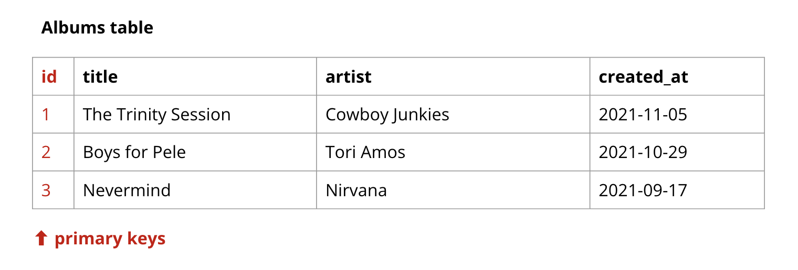
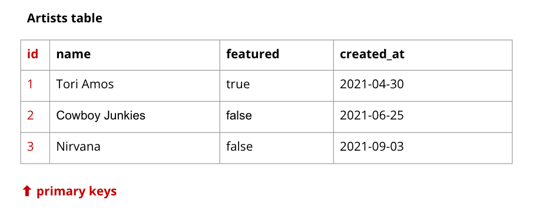
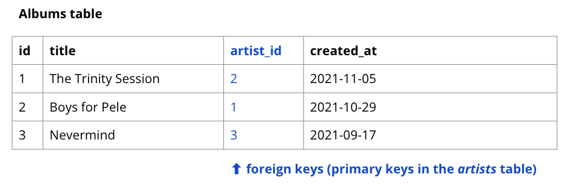

# What is a Foreign Key?

Let's back up and talk about the database generally. Specifically, a **relational database**, which lets us store data across multiple tables and make connections between the tables. A SQL database, like SQLite or PostgreSQL, is a relational database.

## A database has many tables (usually)

We use the database with our Django application to store data -- specifically the data we define and organize with our models. Each row in that table represents an object we can create with our model class blueprints.

### A table stores related data

For instance, if we built software for a retail business, we might want to store information about our products. We'd want a Product model, and that would correspond to a _products_ table in our database. We might want to store information like product name, description, size, price, or color.

But what if we decided that we wanted to also store information about customers? We wouldn't put that data in the _products_ table. We'd create a new table to store information about customers separately.

A _customers_ table might record names, email addresses, street addresses, and phone numbers of many customers.

### A table organizes data into columns and rows

Rows in a table correspond to an object that can be created from that model. In the _products_ table, each row stores data about one individual product. In the customers table, each row stores data about one individual customer.

Columns in a table correspond to attributes on our model. If we want to store that data, we create attributes on our model using Django's model fields, choosing the type of data that we'll use to represent each attribute.

## Primary keys

In database lingo, a **key** is a unique identifier for a record (or _row_) in a table.

A table has a **primary key** which uniquely identifies that row.

## Foreign keys are for related data

This table is fine if all we need to know about an artist is their name. But if we need to record more information about an _artist_, that belongs grouped with _artist_ data, not with _album data. After all, one artist could have more than one album and **we don't want to duplicate the same data in multiple places**.

That table allows us to reduce our **artist** column in the albums table to just an id. That id is what we call a **foreign key**. It lets the album table connect a row to another row in a different -- _foreign_ -- table.

In the above image, the column for _artist_ has been replaced by a new **foreign key** column. The value in that column is the **primary key** of that artist in the _artists_ table -- so it is "foreign" to the _albums_ table.
